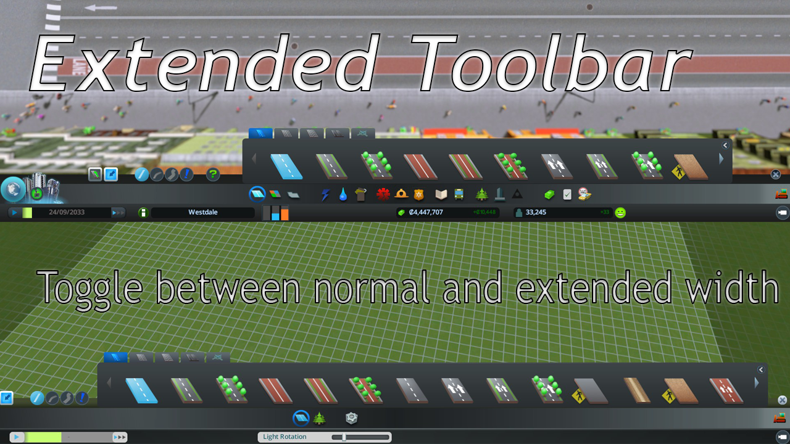

# Cities Skylines: Extended Toolbar

*This mod was previously known as Scrollable Toolbar. But since version 1.1.1,
the ability to scroll on the toolbar was added in the base game and this mod has
been renamed to Extended Toolbar.*

Do you have way too many assets and do you think the toolbar is too small? This
mod enables you to toggle between two width modes: normal and extended. With the
extended mode, the mod tries to extend the toolbar as much as possible to the
right while in-game, and as much as possible to the left in the asset and map
editor.

## Installation
Go to the
[Steam Workshop](http://steamcommunity.com/sharedfiles/filedetails/?id=451700838)
and subscribe to the mod, it will install automatically. This will also keep it
updated with newer releases. If you want to do it manually, you can clone this
repo, compile the code yourself and place the DLL file in your mods folder.

## Compatibility
This mod is based on version 1.1.1 of Cities Skylines, and it is not guaranteed
that it will work on later versions. I'll try to keep it updated when newer
versions are released however.

If a newer version of Cities Skylines breaks your game, don't worry. This mod
should not break your saves (as far as I know). Just disable the mod for the
time being until an update of this mod is released.

### Mods
This mod should be compatible with all mods, as long as they don't significantly
change the toolbar. This means that it's likely that this mod does not work with
Sapphire skins.

#### Limited support
- *Enhanced Build Panel*  
  Only the panels that Enhanced Build Panel does not overwrite, are supported
  by Extended Toolbar.
  You might see the toggle button show up for a second sometimes when it's not
  supposed to be there, but it's nothing to worry about.
- *Sapphire skins*  
  I cannot guarantee that this mod works for every skin out there, since skins
  can change the layout drastically. If you happen to use a skin that does not
  work with Extended Toolbar, please disable this mod.

## Contributing
I'm open for any contributions you can make. If you find a bug, create an issue
here on GitHub. GitHub is very nice with maintaining a list of issues.
Submitting a bug report on the Steam Workshop is also appreciated, but it might
take a little longer for me to respond, because I prefer GitHub. If you know C#,
you can try to fix it yourself and submit a pull request.

### Compilation Notes
Note that setting up your development environment is a bit different from the
Cities Skylines wiki. As you might have noticed, there aren't any hardcoded
references to the assemblies of Cities Skylines. Instead, these dependencies are
currently maintained by me on a NuGet server. This means that upon building, the
dependencies should be resolved automatically. If, for some reason, this doesn't
work, please check if the feed `https://www.myget.org/F/cities-skylines/api/v2`
has been added and that NuGet automatically restores packages upon building.

When a newer version of Cities Skylines is released, it's possible that the
NuGet feed or `packages.config` gets outdated. If there's no apparent work in
progress to update either of those, don't hesitate to create an issue to make me
aware of it.
